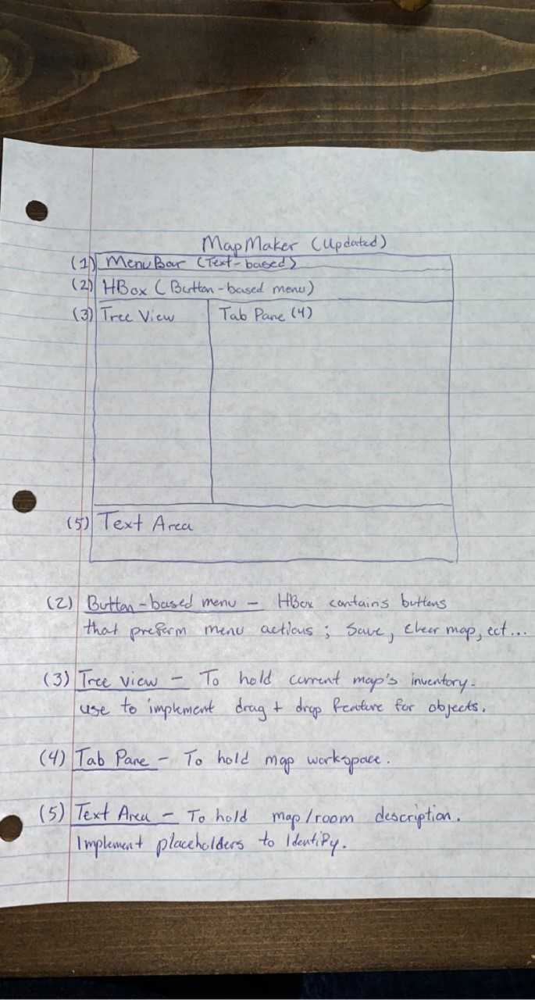

## Team 2
**Project Manager:**   
Joshua Patton

**Quality Control:**  
Rasharious Thomas 

**Developers:**  

Jykia Johnson Hayes 

Mei Perry
## Features
Created new project with JavaFX, added to src file.

Moved old project to src_old.

Added button based menu to UI. (Controller class not conncted)

Added tree view to UI. (Controller class not conncted)

Added tab pane to UI.  (holds map)

Created new controller class to hold GUI's action events. (MapMaperController.java)

Updated conceptual drawings in ReadMe.md. 

Added new doc folder to hold images. (Images)

Added new doc file containing project documentation. (project.help)

## Conceptual Drawings

